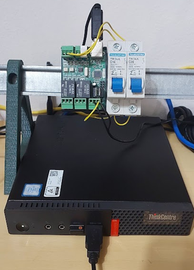
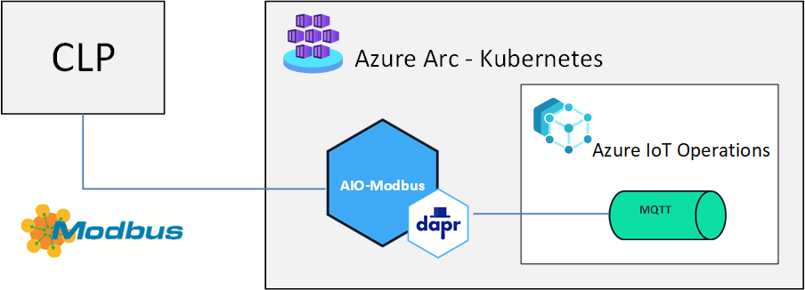
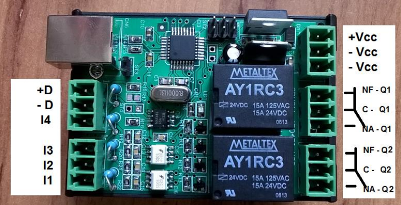
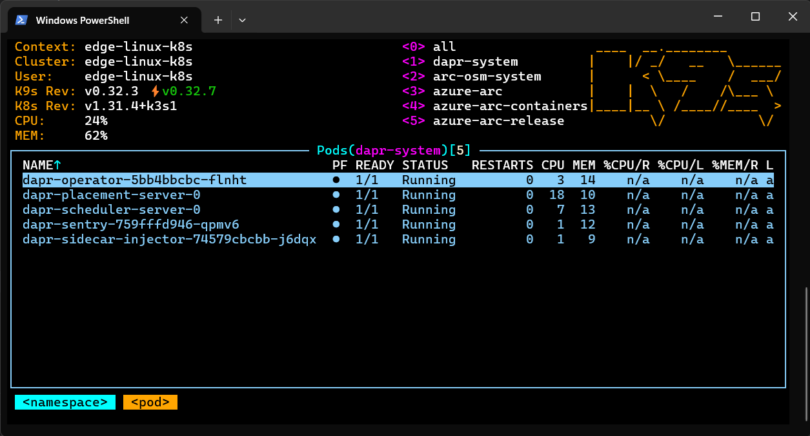
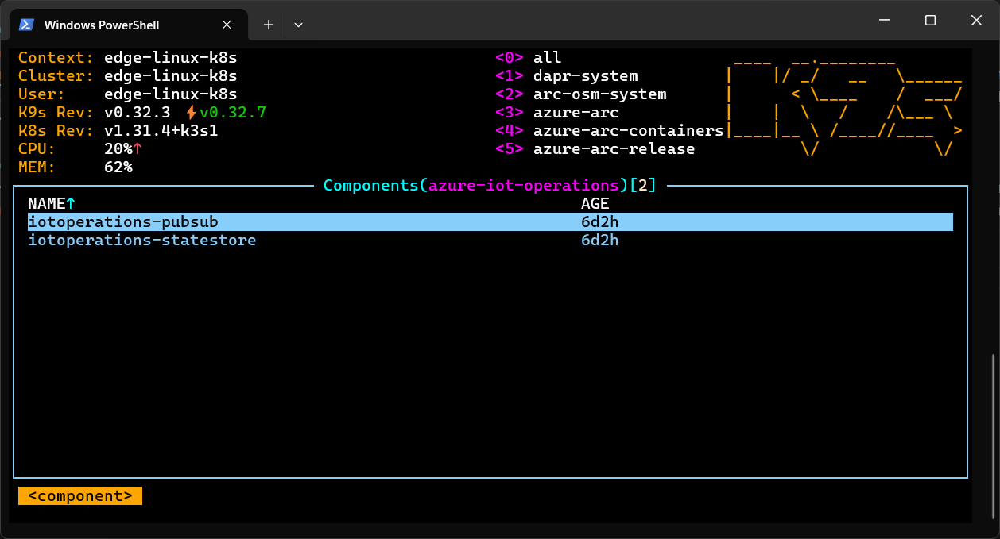
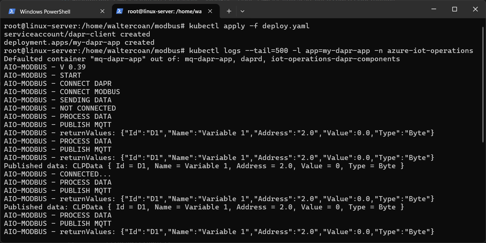
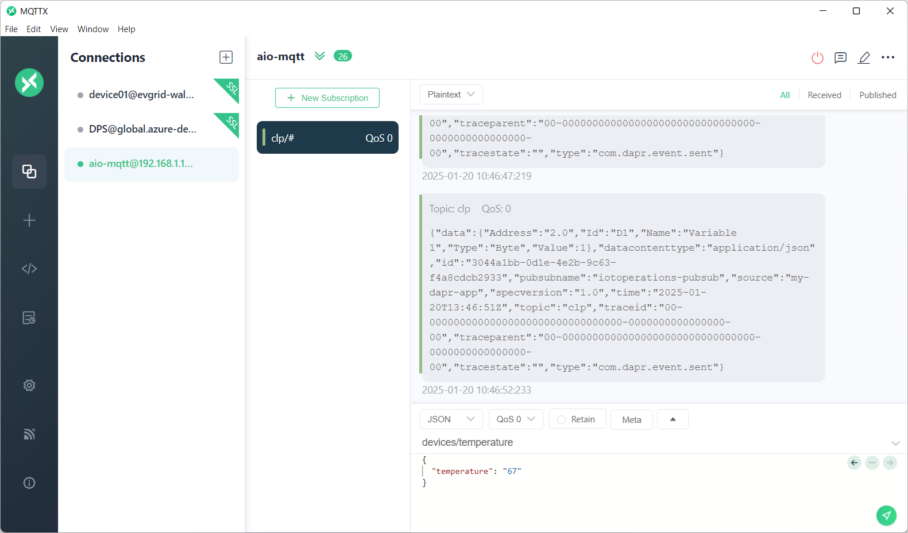

## [pt-BR] Conectando um CLP usando Modbus e Dapr ao Azure IoT Operations


O objetivo deste tutorial é de demonstrar como conectar um CPL (Controlador Móvel Programável) ao [Azure IoT Operations](https://azure.microsoft.com/en-us/products/iot-operations?wt.mc_id=AZ-MVP-5003638) utilizando uma aplicação [.net 9](https://dotnet.microsoft.com/pt-br/download/dotnet/9.0?wt.mc_id=AZ-MVP-5003638) com o framework [Dapr.io](https://dapr.io/?wt.mc_id=AZ-MVP-5003638) através do protocolo industrial Modbus.

## [pt-BR] Arquitetura


- O CLP representa um equipamento industrial que se deseja monitorar ou controlar
- Utilizando o protocolo Modbus RTU através da interface serial USB, se conecta ao dispositivo Edge executando o cluster Azure Arc Kubernetes (neste caso pela porta USB)
- Uma aplicação no .net 9, empacotada como um container Docker é publicada no Azure Arc Kubernetes, no namespace do Azure IoT Operations, e utiliza o runtime Dapr para se conectar ao broker MQTT. Da mesma forma essa aplicação utiliza a biblioteca [Modbus.Net](https://www.nuget.org/packages/Modbus.Net) para se conectar ao CLP e coletar os dados dos registradores.
- No Azure IoT Operations utilizamos seu broker MQTT para receber as mensagens e seu mecanismo de Flow para encaminhar os dados para processamento.

## [pt-BR] CLP


O CLP utilizado é da marca [ProXSys modelo CP-WS11](http://www.cpwscontroladores.com.br/Manuais/mapa_memoria_cpws11_4do4di_usb_V_1_5.pdf), sendo um dispositivo simples para seu uso como ferramenta de teste e aprendizado. Possui um conjunto de duas entradas digitais e dois reles que podem ser controlados. Sua programação é feita através de um software proprietario utilizando a linguagem LADDER. Foram programadas duas operações OP01 e OP02 que leem o estado das portas de entrada e escrevem nos registradores 100002 e 100003 o estado dessas portas. O endereço lógico dispositivo no protocolo Modbus é 1. Ao ser conectar com o dispositivo de borda, é criada uma conexão serial na poprta /dev/ttyACM0 na velocidade de 9600 Baunds por segundo.

## [pt-BR] Instalação do Azure IoT Operations
Neste artigo [Instalando o Azure IoT Operations em um Edge Server Ubuntu 24.04](https://www.linkedin.com/pulse/instalando-o-azure-iot-operations-em-um-edge-server-ubuntu-coan-8amyf/?trackingId=BzyCxAPVRymdG1tzqci%2B2A%3D%3D) descrevo um dos possíveis processos de instalação do Azure IoT Operations em um dispositivo de borda rodando um Kubernetes cluster. Em seguida será necessário fazer a habilitação do cluster no Azure Arc e por fim a instalação do Azure IoT Operations.

## [pt-BR] Instalação do Dapr no Azure IoT Operations
Para simplificar o desenvolvimento da solução, foi utilizado o [Dapr Runtime](https://dapr.io/) no Azure IoT Operations, seguindo este tutoral [este tutoral](https://learn.microsoft.com/en-us/azure/iot-operations/create-edge-apps/howto-deploy-dapr?wt.mc_id=AZ-MVP-5003638) que instala inicialmente os operadores do Dapr no cluster Kubernetes.

E em seguida dois componentes que vão permitir a aplicação comunicar tanto com o MQTT broker através da abstração de pubsub quanto através da abstração de state store.

O próximo passo é construir a aplicação .net utilizando as bibliotecas do Dapr para publicar os dados através da abstração pubsub de forma totalmente desacoplada.

## [pt-BR] Aplicação .net 9 com o Dapr runtime
Para iniciar o desenvolvimento da aplicação foi criada uma nova aplicação .net 9 utilizando o modelo Console.
```
dotnet new console -o aio-modbus
```
Os seguintes pacotes foram instalados através do Nuget:
```
dotnet add package Dapr.Client --version 1.14.0
dotnet add package Modbus.Net --version 1.4.3
dotnet add package Modbus.Net.Modbus --version 1.4.3    
dotnet add package Newtonsoft.Json --version 13.0.3
dotnet add package System.IO.Ports --version 9.0.1
```
Para simplificar o exemplo toda a lógica esta concentrada no arquivo Program.cs.
1. É criada uma instância do Dapr Client, que será responsável por conectar com o sidecar para estabelecer a conexão com o MQTT Broker do Azure IoT Operations.
```
Console.WriteLine("AIO-MODBUS - CONNECT DAPR");
using var client = new DaprClientBuilder().Build();
```
2. Utilizando a biblioteca do Modbus.Net, estabelecemos uma conexão serial RTU com o protocolo Modbus na porta /dev/ttyACM0. Descrevemos os endereços dos registradores do CLP que neste caso é o endereco 100002, onde o parâmetro Area = "1X" representa os dois primeiros bytes do endereço (10) e o Address = 2 representa o restante do endereço (0002).
```
Console.WriteLine("AIO-MODBUS - CONNECT MODBUS");
List<AddressUnit> addressUnits = new List<AddressUnit>
{
    new AddressUnit() {Id = "D1", Name="Variable 1", Area = "1X", Address = 2, CommunicationTag = "D1", DataType = typeof(byte)}
};
var  machine = new ModbusMachine("CLP",ModbusType.Rtu, "/dev/ttyACM0", addressUnits, true, 1, 3, Endian.BigEndianLsb);
```
3. Registramos um Scheduler, que a cada 5 segundos irá consultar todos os endereços dos registradores do CLP, coletar seu estado, e criar uma instância da classe CLPData que será então publicada no serviço de pubsub do Dapr.
```
Console.WriteLine("AIO-MODBUS - SENDING DATA");
await MachineJobSchedulerCreator.CreateScheduler("Trigger1", -1, 5).Result.From(machine.Id, machine, MachineDataType.CommunicationTag).Result.Query("Query1",
    returnValues =>
    {
        
        if (returnValues.ReturnValues.Datas != null)
        {            
            lock (values)
            {
                Console.WriteLine("AIO-MODBUS - PROCESS DATA");
                var unitValues = from val in returnValues.ReturnValues.Datas
                                select
                                new Tuple<AddressUnit, double?>(
                                    addressUnits.FirstOrDefault(p => p.CommunicationTag == val.Key)!, val.Value.DeviceValue);

                values = from unitValue in unitValues
                        select
                        new CLPData(
                            unitValue.Item1.Id,
                            unitValue.Item1.Name,
                            unitValue.Item1.Address + "." + unitValue.Item1.SubAddress,
                            unitValue.Item2 ?? 0,
                            unitValue.Item1.DataType.Name
                        );
                
            }
            Console.WriteLine("AIO-MODBUS - PUBLISH MQTT");
            values.ToList().ForEach(item => {
                    
                    var dumpjson = Newtonsoft.Json.JsonConvert.SerializeObject(item);
                    Console.WriteLine("AIO-MODBUS - returnValues: " + dumpjson);

                    client.PublishEventAsync("iotoperations-pubsub", "clp", item).Wait();    
                    Console.WriteLine("Published data: " + item);
                }
            );
            values.ToList().RemoveAll(p => true);
        }
        else
        {
            Console.WriteLine($"ip {returnValues.MachineId} not return value");
        }
        return null;
    }).Result.Run();
```
A biblioteca Modbus.net necessita de um arquivo appsettings.default.json contendo a parametrização da comunicação serial que será realizada.
```
{
  "Modbus.Net": {
    "COM": {
      "FetchSleepTime": "100",
      "ConnectionTimeout": "5000",
      "BaudRate": "BaudRate9600",
      "Parity": "Odd",
      "StopBits": "One",
      "DataBits": "Eight",
      "Handshake": "None",
      "FullDuplex": "False"
    },
    "Controller": {
      "WaitingListCount": "100"
    }
  }
}

```


### [pt-BR] Build da aplicação
Para o build da aplicação foi criado um arquivo Dockerfile, que utiliza a estratégia de multi-stage para primeiro compilar o projeto e depois gerar a imagem final. Importante destacar que para que a aplicação tenha acesso a porta serial no dispositivo foi utilizada a estratégia de execução do processo como um usuário root. Essa estratégia pode ser evitada criando um usuário específico com permissões de leitura e escrita na porta serial.
```
FROM mcr.microsoft.com/dotnet/sdk:9.0@sha256:3fcf6f1e809c0553f9feb222369f58749af314af6f063f389cbd2f913b4ad556 AS build
WORKDIR /App

COPY . ./
RUN dotnet restore
RUN dotnet publish -o out
COPY ./appsettings.* ./out

# Build runtime image
FROM mcr.microsoft.com/dotnet/aspnet:9.0@sha256:b4bea3a52a0a77317fa93c5bbdb076623f81e3e2f201078d89914da71318b5d8
WORKDIR /App
COPY --from=build /App/out .
USER root

ENTRYPOINT ["dotnet", "aio-modbus.dll"]
```
Uma vez feito o build da imagem Docker e feito o push para um container registry, o próximo passo é o deploy da aplicação no dispositivo de borda.

## [pt-BR] Deploy da aplicação
Para o deploy foi criado um arquivo YAML para deploy no cluster, [similar ao descrito neste tutorial](https://learn.microsoft.com/en-us/azure/iot-operations/create-edge-apps/howto-develop-dapr-apps?wt.mc_id=AZ-MVP-5003638) sendo que a principal mudança foi a necessidade de montar o volume apontando para a porta serial /dev/ttyACM0 e dando permissão elevada de privilégios: privileged: true

```
apiVersion: v1
kind: ServiceAccount
metadata:
  name: dapr-client
  namespace: azure-iot-operations
  annotations:
    aio-broker-auth/group: dapr-workload
---
apiVersion: apps/v1
kind: Deployment
metadata:
  name: my-dapr-app
  namespace: azure-iot-operations
spec:
  selector:
    matchLabels:
      app: my-dapr-app
  template:
    metadata:
      labels:
        app: my-dapr-app
      annotations:
        dapr.io/enabled: "true"
        dapr.io/inject-pluggable-components: "true"
        dapr.io/app-id: "my-dapr-app"
    spec:
      serviceAccountName: dapr-client

      volumes:
      # SAT used to authenticate between Dapr and the MQTT broker
      - name: mqtt-client-token
        projected:
          sources:
            - serviceAccountToken:
                path: mqtt-client-token
                audience: aio-internal
                expirationSeconds: 86400

      # Certificate chain for Dapr to validate the MQTT broker
      - name: aio-ca-trust-bundle
        configMap:
          name: azure-iot-operations-aio-ca-trust-bundle
      - name: tty
        hostPath:
          path: /dev/ttyACM0
      containers:
      # Container for the Dapr application
      - name: mq-dapr-app
        image: waltercoan/aio-modbus:latest
        volumeMounts:
          - name: tty
            mountPath: /dev/ttyACM0
        securityContext:
          privileged: true
```
Esta imagem mostra a execução do comando que publica a aplicação e que consulta os logs da execução do pod dentro do cluster kubernetes.

Esta imagem ilustra um cliente conectado ao broker MQTT do Azure IoT Operations consumindo as mensagens geradas pela aplicação que monitora o CLP.


